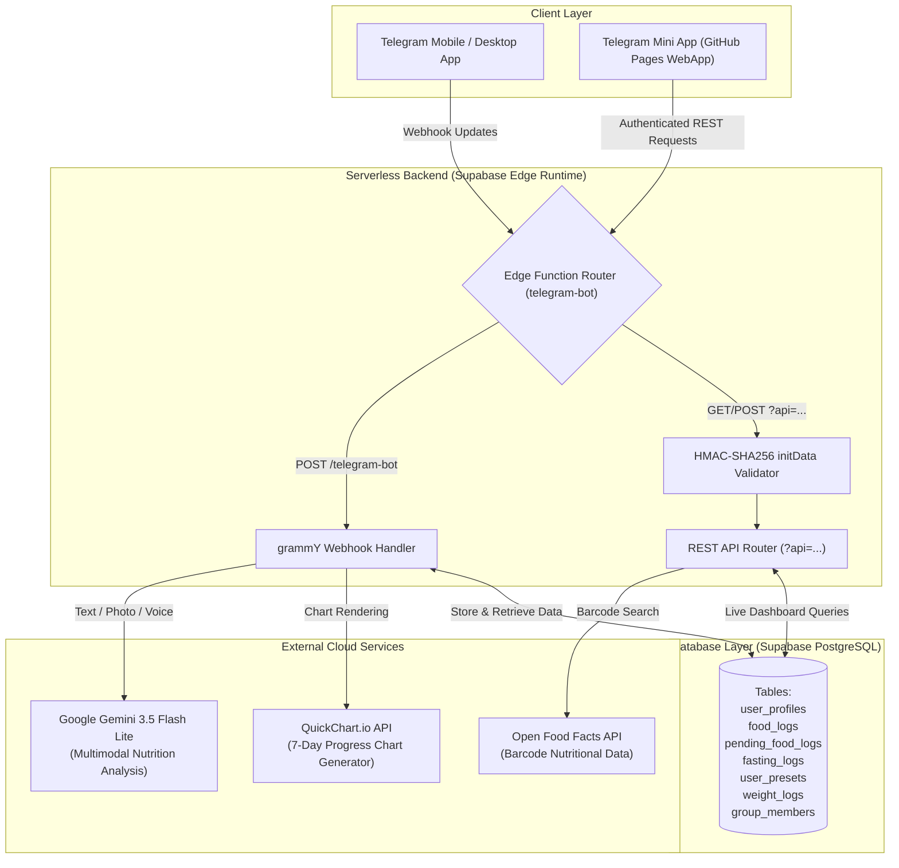

# 🥑 Calorie Tracker Telegram Bot & WebApp

[](https://t.me)
[](https://supabase.com)
[](https://ai.google.dev)
[](https://grammy.dev)
[](LICENSE)

An intelligent, full-featured nutrition and fitness tracking assistant built for Telegram. Log meals using **natural language text**, **food photos**, or **voice notes** powered by **Google Gemini 3.5 Flash Lite**. Features an interactive **Telegram Mini App (WebApp)** dashboard hosted on GitHub Pages, real-time intermittent fasting timers, barcode scanning via Open Food Facts, visual 7-day infographic report cards, custom macronutrient targets, and AI coaching with selectable personalities.

---

## 📑 Table of Contents

- [System Architecture](#-system-architecture)
- [Key Features](#-key-features)
  - [Multimodal AI Meal Logging](#1-multimodal-ai-meal-logging)
  - [Interactive WebApp Dashboard (Telegram Mini App)](#2-interactive-webapp-dashboard-telegram-mini-app)
  - [Intermittent Fasting Tracker](#3-intermittent-fasting-tracker)
  - [Barcode Scanner (Open Food Facts)](#4-barcode-scanner-open-food-facts)
  - [Adaptive AI Nutrition Coach](#5-adaptive-ai-nutrition-coach)
  - [Visual 7-Day Infographic Report Cards](#6-visual-7-day-infographic-report-cards)
  - [1-Tap Presets & Supplements](#7-1-tap-presets--supplements)
  - [Group Leaderboards & Weight Tracking](#8-group-leaderboards--weight-tracking)
  - [Data Export (CSV)](#9-data-export-csv)
- [Telegram Bot Commands](#-telegram-bot-commands)
- [Database Schema (PostgreSQL)](#-database-schema-postgresql)
- [REST API Reference](#-rest-api-reference)
- [Technology Stack](#-technology-stack)
- [Environment Variables & Secrets](#-environment-variables--secrets)
- [Setup & Deployment Guide](#-setup--deployment-guide)
  - [1. Database Setup](#1-database-setup)
  - [2. Supabase Secrets Configuration](#2-supabase-secrets-configuration)
  - [3. Edge Function Deployment](#3-edge-function-deployment)
  - [4. Telegram Webhook Registration](#4-telegram-webhook-registration)
  - [5. GitHub Pages WebApp Hosting](#5-github-pages-webapp-hosting)
- [Security & Authentication](#-security--authentication)
- [Troubleshooting & FAQ](#-troubleshooting--faq)
- [License](#-license)

---

## 🏗️ System Architecture



---

## ✨ Key Features

### 1. Multimodal AI Meal Logging
- **Natural Language Text:** Simply send `"2 scrambled eggs, avocado toast and black coffee"`.
- **Plate Photos:** Take a picture of your dish directly in Telegram; the bot analyzes portions and calculates calories and macros.
- **Voice Notes:** Send a quick voice message describing your meal (*"Had a chicken salad bowl with olive oil dressing and walnuts"*).
- **Two Logging Modes:**
  - **Itemized Mode:** Breaks dishes down into individual ingredients with separate macro counts.
  - **Single Combined Mode:** Aggregates the entire meal into one consolidated record.
- **Inline Confirmation:** Displays an interactive inline keyboard (`✅ Confirm & Log`, `✏️ Adjust`, `⭐ Save as Preset`, `❌ Cancel`) before saving to the database.

### 2. Interactive WebApp Dashboard (Telegram Mini App)
Accessible via the persistent `📊 Dashboard` menu button inside Telegram or on GitHub Pages:
- **Calorie Budget Ring:** Live visual gauge comparing calories consumed against your daily goal.
- **Macronutrient Breakdown:** Dynamic progress bars for Protein, Carbs, and Fats. Supports custom gram goals or automatic 30/40/30 distribution.
- **Interactive 7-Day Chart:** Built with Chart.js, featuring day-by-day inspection pills.
- **Resilient Cold-Start Handling:** Employs adaptive progressive timers (0s, 3.5s, 8s, 16s) and automated background retries (up to 3 attempts) to gracefully handle serverless cold starts. Never falls back to fake or demo data.
- **Zero-Latency State Management:** Centralized authenticated API gateway passes Telegram `initData` securely.

### 3. Intermittent Fasting Tracker
- **Fast Protocols:** 16:8 (LeanGains), 18:6 (Intermediate), and 20:4 (Warrior Fast).
- **Interactive SVG Ring Timer:** Real-time circular progress ring with elapsed hours, remaining time, and completion percentage.
- **Command & WebApp Sync:** Start, monitor, complete, or cancel fasts seamlessly from either Telegram chat commands (`/fast`) or the WebApp dashboard.

### 4. Barcode Scanner (Open Food Facts)
- **In-App Camera Scanner:** Integrated camera scanner powered by `html5-qrcode` inside the WebApp.
- **Text Barcode Lookup:** Send `/barcode <number>` directly in chat.
- **Portion Adjustment:** Interactive portion multiplier pills (`0.5x`, `1.0x`, `1.5x`, `2.0x`) with live recalculation of calories and macros before logging.

### 5. Adaptive AI Nutrition Coach
Select from three distinct AI coach personalities via `/persona` or the WebApp Settings tab:
- **💖 Supportive Cheerleader:** Warm, encouraging, celebratory feedback focusing on consistency.
- **🪖 Drill Sergeant:** Strict, disciplined, militant accountability with zero tolerance for excuses.
- **😏 Sarcastic & Witty:** Hilarious, playful roasts and witty commentary on your daily food choices.

### 6. Visual 7-Day Infographic Report Cards
- Trigger on demand via `/weeklyreport` or automated Sunday evening cron.
- Generates a visual report card featuring:
  - Weekly letter grade (`A+` to `D`) based on target adherence.
  - QuickChart.io bar chart comparing daily calories vs. target line.
  - Macro ratio breakdown (Protein / Carbs / Fats).
  - 14-day weight delta.
  - Personalized weekly debrief written by your AI coach.

### 7. 1-Tap Presets & Supplements
- Save recurring meals, snacks, protein shakes, or creatine supplements as presets.
- 1-tap re-logging via `/presets` in chat or the **Presets** tab in the WebApp.

### 8. Group Leaderboards & Weight Tracking
- **Group Leaderboards:** Add the bot to your fitness or family Telegram group. Members join via `/joinleaderboard` and compete on `/leaderboard` (sorted by consistency streak and daily targets).
- **Weight Logging:** Track body weight with `/weight <kg>` and visualize trends with `/progress`.

### 9. Data Export (CSV)
- Export complete meal history anytime with `/export` or via the WebApp.
- Delivered directly as an attached `.csv` document in your Telegram chat, or downloaded directly in the browser.

---

## 🤖 Telegram Bot Commands

| Command | Description | Example |
|---|---|---|
| `/today` | 📅 View today's summary, macros, calories, and consistency streak | `/today` |
| `/fast` | ⏰ Launch or manage the Intermittent Fasting timer | `/fast 16` |
| `/barcode` | 📸 Scan or look up a packaged food barcode | `/barcode 3017620422003` |
| `/weeklyreport` | 📑 Generate and receive a 7-day visual report card graphic | `/weeklyreport` |
| `/presets` | ⭐ View and 1-tap log your saved presets and supplements | `/presets` |
| `/history` | 📊 View your 7-day calorie history and day-by-day logs | `/history` |
| `/persona` | 🤖 Switch your AI Coach style (Supportive, Sergeant, Sarcastic) | `/persona` |
| `/mode` | 🍲 Switch logging mode (Itemized Ingredients vs. Combined Meal) | `/mode` |
| `/export` | 📥 Export your full food diary as a CSV file to chat | `/export` |
| `/weight` | ⚖️ Log your current body weight in kilograms | `/weight 74.5` |
| `/progress` | 📈 Generate a 30-day weight tracking chart | `/progress` |
| `/leaderboard` | 🏆 View the group member calorie & streak leaderboard | `/leaderboard` |
| `/joinleaderboard` | 👥 Enroll yourself into the current group's leaderboard | `/joinleaderboard` |
| `/reminders` | 🔔 Toggle daily midday and evening check-in reminders | `/reminders` |
| `/delete` | 🗑️ Inspect and delete individual items logged today | `/delete` |
| `/target` | 🎯 Update your daily caloric goal | `/target 2500` |
| `/help` | ℹ️ Display the comprehensive help and instruction manual | `/help` |
| `/start` | 👋 Getting started guide and account registration | `/start` |

---

## 🗄️ Database Schema (PostgreSQL)

The system uses 7 relational tables in PostgreSQL managed with Supabase Row Level Security (RLS).

```sql
-- 1. User Profiles & Settings
CREATE TABLE public.user_profiles (
  user_id bigint PRIMARY KEY,
  daily_target integer NOT NULL DEFAULT 2000,
  target_protein integer,
  target_carbs integer,
  target_fat integer,
  reminders_enabled boolean NOT NULL DEFAULT false,
  streak_count integer NOT NULL DEFAULT 0,
  last_log_date date,
  first_name text,
  username text,
  editing_pending_id uuid,
  persona text NOT NULL DEFAULT 'sarcastic',
  logging_mode text NOT NULL DEFAULT 'itemized',
  created_at timestamp with time zone DEFAULT now()
);

-- 2. Confirmed Food Logs
CREATE TABLE public.food_logs (
  id uuid PRIMARY KEY DEFAULT gen_random_uuid(),
  user_id bigint NOT NULL REFERENCES public.user_profiles(user_id) ON DELETE CASCADE,
  food_name text NOT NULL,
  calories integer NOT NULL,
  protein integer NOT NULL DEFAULT 0,
  carbs integer NOT NULL DEFAULT 0,
  fat integer NOT NULL DEFAULT 0,
  meal_type text DEFAULT 'Snack',
  barcode text,
  created_at timestamp with time zone DEFAULT now()
);

-- 3. Staging / Pending Food Logs (Waiting for inline confirmation)
CREATE TABLE public.pending_food_logs (
  id uuid PRIMARY KEY DEFAULT gen_random_uuid(),
  user_id bigint NOT NULL REFERENCES public.user_profiles(user_id) ON DELETE CASCADE,
  food_name text NOT NULL,
  calories integer NOT NULL,
  protein integer NOT NULL DEFAULT 0,
  carbs integer NOT NULL DEFAULT 0,
  fat integer NOT NULL DEFAULT 0,
  meal_type text DEFAULT 'Snack',
  items jsonb,
  created_at timestamp with time zone DEFAULT now()
);

-- 4. Intermittent Fasting Logs
CREATE TABLE public.fasting_logs (
  id uuid PRIMARY KEY DEFAULT gen_random_uuid(),
  user_id bigint NOT NULL REFERENCES public.user_profiles(user_id) ON DELETE CASCADE,
  target_hours numeric NOT NULL DEFAULT 16,
  start_time timestamp with time zone NOT NULL DEFAULT now(),
  end_time timestamp with time zone,
  status text NOT NULL DEFAULT 'active', -- 'active', 'completed', 'cancelled'
  created_at timestamp with time zone DEFAULT now()
);

-- 5. Saved Food Presets & Supplements
CREATE TABLE public.user_presets (
  id uuid PRIMARY KEY DEFAULT gen_random_uuid(),
  user_id bigint NOT NULL REFERENCES public.user_profiles(user_id) ON DELETE CASCADE,
  food_name text NOT NULL,
  calories integer NOT NULL DEFAULT 0,
  protein integer NOT NULL DEFAULT 0,
  carbs integer NOT NULL DEFAULT 0,
  fat integer NOT NULL DEFAULT 0,
  created_at timestamp with time zone DEFAULT now()
);

-- 6. Body Weight Tracking Logs
CREATE TABLE public.weight_logs (
  id uuid PRIMARY KEY DEFAULT gen_random_uuid(),
  user_id bigint NOT NULL REFERENCES public.user_profiles(user_id) ON DELETE CASCADE,
  weight numeric(5,2) NOT NULL,
  created_at timestamp with time zone DEFAULT now()
);

-- 7. Group Leaderboard Associations
CREATE TABLE public.group_members (
  group_id bigint NOT NULL,
  user_id bigint NOT NULL REFERENCES public.user_profiles(user_id) ON DELETE CASCADE,
  joined_at timestamp with time zone DEFAULT now(),
  PRIMARY KEY (group_id, user_id)
);
```

---

## 🔌 REST API Reference

The Supabase Edge Function serves both as the Telegram webhook receiver (`POST /`) and as the authenticated REST API (`?api=<action>`) for the Telegram Mini App.

All requests accept Telegram WebApp authentication via:
- `X-Telegram-Init-Data: <raw_init_data>` header, OR
- `&initData=<url_encoded_init_data>` query parameter.

| Endpoint | Method | Description | Parameters / Payload |
|---|---|---|---|
| `?api=dashboard` | `GET` | Fetches live user profile, today's totals, 7-day history, presets, and active fasts in a single parallel query | `initData` or `userId` |
| `?api=lookup_barcode` | `GET` | Queries Open Food Facts for product data by barcode | `barcode=<barcode_string>` |
| `?api=log_barcode_meal` | `POST` | Logs a scanned barcode product directly to the user's food log | `{ food_name, calories, protein, carbs, fat, meal_type, barcode }` |
| `?api=start_fast` | `POST` | Starts a new intermittent fasting session | `{ target_hours, custom_start_time? }` |
| `?api=stop_fast` | `POST` | Ends and marks the active fasting session as completed | None |
| `?api=cancel_fast` | `POST` | Cancels the ongoing fasting session | None |
| `?api=delete_food` | `POST` | Deletes a logged meal by its UUID | `{ log_id }` |
| `?api=log_preset` | `POST` | Logs a saved preset item into today's diary | `{ preset_id }` |
| `?api=delete_preset` | `POST` | Removes a preset from saved items | `{ preset_id }` |
| `?api=update_target` | `POST` | Updates daily caloric intake target | `{ target }` |
| `?api=update_macros` | `POST` | Configures custom macro targets or resets to auto 30/40/30 | `{ protein, carbs, fat }` or `{ is_auto: true }` |
| `?api=update_persona` | `POST` | Updates AI Coach persona | `{ persona: 'supportive' \| 'sergeant' \| 'sarcastic' }` |
| `?api=update_logging_mode` | `POST` | Sets logging granularity | `{ mode: 'itemized' \| 'combined' }` |
| `?api=export_csv_to_chat` | `POST` | Generates a CSV file and sends it as a Telegram document to the user's chat | None |
| `?api=export_all_logs` | `GET` | Returns full historical meal records as JSON for browser CSV export | None |
| `?api=generate_weekly_report` | `POST` | Triggers generation and chat delivery of the 7-day visual report card | None |

---

## 🛠️ Technology Stack

| Layer | Technology | Rationale |
|---|---|---|
| **Serverless Runtime** | [Deno](https://deno.land) on [Supabase Edge Functions](https://supabase.com/docs/guides/functions) | Globally distributed, sub-second latency, zero infrastructure maintenance |
| **Bot Framework** | [grammY](https://grammy.dev) (`npm:grammy@^1`) | Modern, type-safe TypeScript Telegram framework with Webhook support |
| **Artificial Intelligence** | [Google Gemini 3.5 Flash Lite](https://ai.google.dev) | Ultra-fast multimodal inference for text, image, and voice food recognition |
| **Database** | [PostgreSQL (Supabase)](https://supabase.com) | Relational integrity, JSONB support for itemized meals, Row Level Security |
| **Web App Frontend** | Vanilla HTML5, CSS3, Modern JS (ES2022) | Zero build-step requirement, lightweight, loads instantly in Telegram WebViews |
| **Data Visualizations** | [Chart.js](https://www.chartjs.org) & [QuickChart.io](https://quickchart.io) | Interactive client-side charting + static server-generated infographic images |
| **Barcode Scanning** | [html5-qrcode](https://github.com/mebjas/html5-qrcode) | Native HTML5 camera stream barcode scanning inside mobile Telegram WebApps |
| **Nutritional Data** | [Open Food Facts API](https://world.openfoodfacts.org) | Open-source global barcode database with >3 million verified food items |
| **Static Hosting** | [GitHub Pages](https://pages.github.com) | Free, secure, reliable SSL static hosting for the Telegram Mini App |

---

## 🔐 Environment Variables & Secrets

Configure the following secrets in your Supabase Project Dashboard (**Project Settings > Edge Functions > Secrets**):

```bash
# Telegram Bot Token obtained from @BotFather
CALORIE_BOT_TOKEN="123456789:ABCdefGhIJKlmNoPQRstuVWXyz"

# Google Gemini API Key from Google AI Studio
GEMINI_API_KEY="AIzaSyYourSecretGeminiApiKeyHere"

# Supabase URL & Service Role Key (automatically provided by Supabase in runtime, or set explicitly)
SUPABASE_URL="https://your-project-id.supabase.co"
SUPABASE_SERVICE_ROLE_KEY="eyJhbGciOiJIUzI1NiIsInR5cCI6IkpXVCJ9..."
```

> [!IMPORTANT]
> Never commit actual secret keys or your `.env` file to version control. Always keep `.env` listed in `.gitignore`.

---

## 🚀 Setup & Deployment Guide

### 1. Database Setup
1. Open your Supabase Project Dashboard and navigate to the **SQL Editor**.
2. Run the SQL schema definitions sequentially:
   - `supabase-schema.sql` (Core profiles, logs, staging)
   - `supabase-schema-v2.sql` (Macros, streaks, weight logs)
   - `supabase-schema-v3.sql` (Group leaderboards)
   - `supabase-schema-v3.1.sql` (User presets)
   - `supabase-schema-v3.2.sql` (Names, meal types)
   - `fasting_logs` schema (Fasting timer support)

### 2. Supabase Secrets Configuration
Store your bot token and Gemini API key securely in Supabase:

```bash
supabase secrets set CALORIE_BOT_TOKEN="your_bot_token"
supabase secrets set GEMINI_API_KEY="your_gemini_api_key"
```

### 3. Edge Function Deployment
Deploy the Edge Function using the Supabase CLI (or the Supabase Management API):

```bash
supabase functions deploy telegram-bot --no-verify-jwt
```

> [!NOTE]
> `--no-verify-jwt` is required because Telegram Webhook POST requests are sent directly from Telegram's servers without a Supabase bearer token.

### 4. Telegram Webhook Registration
Register your deployed Edge Function as the Telegram Webhook:

```bash
curl -F "url=https://<your-project-id>.supabase.co/functions/v1/telegram-bot" \
  https://api.telegram.org/bot<CALORIE_BOT_TOKEN>/setWebhook
```

Verify your webhook status anytime:
```bash
curl https://api.telegram.org/bot<CALORIE_BOT_TOKEN>/getWebhookInfo
```

### 5. GitHub Pages WebApp Hosting
1. The static web application is located in the `docs/` folder.
2. In your GitHub repository settings, go to **Pages** and set:
   - **Source:** Deploy from a branch
   - **Branch:** `main`
   - **Folder:** `/docs`
3. Your WebApp will be live at `https://<username>.github.io/<repo-name>/`.
4. The bot automatically configures the chat menu button (`setChatMenuButton`) to open your WebApp URL on first launch.

---

## 🛡️ Security & Authentication

- **Telegram `initData` HMAC-SHA256 Verification:**
  Every request from the WebApp passes Telegram's cryptographically signed `initData`. The backend validates the HMAC signature using a secret key derived from `HMAC_SHA256("WebAppData", botToken)` to prevent request forgery and verify user identity.
- **Multi-Token Candidate Handling:**
  The validation logic supports both `CALORIE_BOT_TOKEN` and `TELEGRAM_BOT_TOKEN` environment secrets to maintain continuous session authentication during token rotations.
- **Row Level Security (RLS):**
  All database tables enforce RLS, ensuring user records are isolated and only accessible by authorized sessions and the backend service role.
- **Native Web API Encoders:**
  Photo and voice base64 operations run purely on native `Uint8Array` / `btoa` buffer operations without external unstable dependencies.

---

## ❓ Troubleshooting & FAQ

<details>
<summary><strong>1. Why does the dashboard say "Loading..." for a few seconds on first open?</strong></summary>
Supabase Edge Functions are serverless workers. When inactive, workers spin down to conserve resources. On the first launch, the worker takes 3-5 seconds to warm up and establish the database connection pool. The frontend includes automatic progressive loading indicators and background retries so users never experience failed loads.
</details>

<details>
<summary><strong>2. How do I change the time zone from Singapore (SGT / UTC+8)?</strong></summary>
The bot utilizes Singapore Time (`Asia/Singapore`) for day boundaries, streak calculations, and meal type detection (Breakfast, Lunch, Dinner). To modify the timezone, update the <code>getSGTDateStr</code> and <code>getSGTStartOfDayISO</code> helper functions in <code>supabase/functions/telegram-bot/index.ts</code> to your preferred IANA timezone string (e.g., <code>America/New_York</code> or <code>Europe/London</code>).
</details>

<details>
<summary><strong>3. Which AI model does the bot use for food recognition?</strong></summary>
The bot uses <strong>Google Gemini 3.5 Flash Lite</strong> (<code>gemini-3.5-flash-lite</code>), offering sub-second response times and precise multimodal vision/audio parsing.
</details>

---

## 📄 License

This project is licensed under the **MIT License**. See the [LICENSE](LICENSE) file for details.
